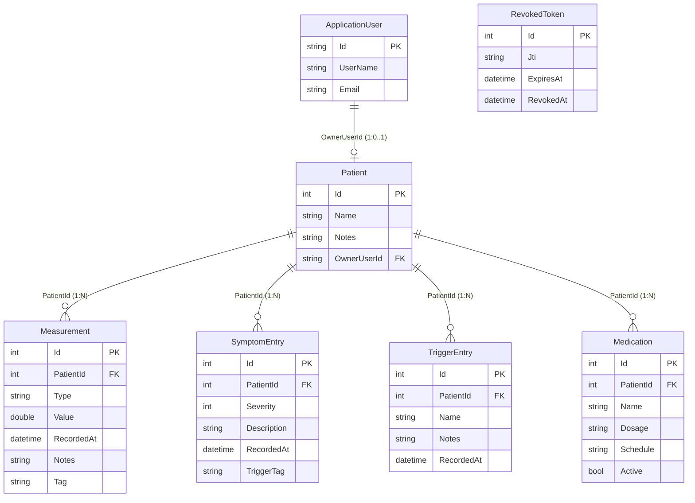

# Dokumentacja techniczna

## Cel i zakres
Opis architektury, zależności, uruchomienia, API, bazy danych i procedur operacyjnych dla Respira Libere (backend ASP.NET Core + frontend React).

## Architektura
- Backend: ASP.NET Core 10, JWT + Identity, EF Core + SQLite (domyślnie). Middleware rewokacji tokenów.
- Frontend: React (CRA) z logiką ról (Admin/Doctor/Patient) i eksportami CSV/PDF.
- Integracje: klient AirPollen (Open-Meteo) — bezpłatny, bez klucza API, wymaga jedynie współrzędnych geograficznych.

## Wymagania środowiskowe

### Backend
| Wymaganie | Minimalne | Zalecane |
|-----------|-----------|---------|
| .NET SDK | 10.x | 10.x (najnowszy patch) |
| System operacyjny | Windows 10 / macOS 12 / Ubuntu 22.04 | Linux (Ubuntu 22.04+) |
| RAM | 512 MB | 1 GB |
| Dysk | 200 MB (app + SQLite DB) | 500 MB |
| SQLite | wbudowany w SDK | — |

### Frontend
| Wymaganie | Minimalne | Zalecane |
|-----------|-----------|---------|
| Node.js | 18.x | 20.x LTS |
| Przeglądarka | Chromium/Chrome/Edge (ostatnie 2 wersje) | Chrome |
| RAM (przeglądarka) | 256 MB wolnych | 512 MB |

Dev URL: API `http://localhost:5000`, Frontend `http://localhost:3000`.
Brak środowiska produkcyjnego — projekt lokalny. Dodanie nowego hosta wymaga uzupełnienia listy CORS.

## Zależności kluczowe (backend)
- `Microsoft.AspNetCore.Authentication.JwtBearer` 7.0.0
- `Microsoft.AspNetCore.Identity.EntityFrameworkCore` 7.0.0
- `Microsoft.EntityFrameworkCore.Sqlite/Tools` 7.0.0
- `QuestPDF` 2024.3.0 (generowanie PDF)
- `System.IdentityModel.Tokens.Jwt` 8.15.0

## Konfiguracja i sekrety
- `appsettings.json`: `JwtSettings:{Key,Issuer,Audience,DurationInMinutes}`, `ConnectionStrings:DefaultConnection` (domyślnie `Data Source=respira.db`).
- **JWT key**: plik zawiera klucz dev-placeholder. W każdym środowisku innym niż lokalny dev ustaw klucz przez zmienną środowiskową:
  ```
  export JwtSettings__Key=$(openssl rand -hex 32)
  ```
  Lub w docker-compose / systemd environment. Klucz musi mieć min. 32 bajty; aplikacja odmówi startu jeśli warunek nie jest spełniony.
- CORS: tylko localhost (front 3000, API 5000). Jeśli front uruchamiasz z innego hosta/portu, dopisz go do `Cors:AllowedOrigins`.
- Role i konta demo w seederze (Admin/Doctor/Patient) — ładowane przy starcie po migracjach.

## Model danych

### Diagram ER



### Tabela pól z walidacją

| Model | Pole | Typ | Walidacja |
|-------|------|-----|-----------|
| Patient | Name | string | Required, MaxLength(128) |
| Patient | Notes | string | MaxLength(1024) |
| Patient | OwnerUserId | string? | MaxLength(450), unikalny (jeśli ustawiony) |
| Measurement | Type | string | Required, MaxLength(32); wartości: `PEF`, `SpO2`, `FEV1` |
| Measurement | Value | double | Range(0, 5000) |
| Measurement | RecordedAt | DateTime | Required, UTC |
| Measurement | Tag | string? | MaxLength(64); np. `poranny`, `przed_lekiem`, `po_leku` |
| SymptomEntry | Severity | int | Required, Range(1, 5): 1=Łagodne … 5=Bardzo silne |
| SymptomEntry | Description | string | Required, MaxLength(512) |
| SymptomEntry | TriggerTag | string? | MaxLength(64) |
| TriggerEntry | Name | string | Required, MaxLength(128) |
| TriggerEntry | Notes | string? | MaxLength(512) |
| Medication | Name | string | Required, MaxLength(128) |
| Medication | Dosage | string? | MaxLength(128) |
| Medication | Schedule | string? | MaxLength(128); np. `"08:00;20:00"` lub `"PRN"` |
| Medication | Active | bool | Domyślnie `true` |
| RevokedToken | Jti | string | Required |
| RevokedToken | ExpiresAt | DateTime | UTC; używane do czyszczenia starych wpisów |

## Migracje i seedy
- Migracje w projekcie API; uruchomienie: `dotnet ef database update` (z katalogu API).
- Seeder ról i kont demo: wykonywany w `Program.cs` podczas startu (po migracji).
- Konta demo: `admin@example.com`, `lekarz@example.com`, `pacjent@example.com` (hasło `Password1!`).

## API

Pełna interaktywna dokumentacja: **Swagger UI** → `http://localhost:5000/swagger` (dostępny gdy backend uruchomiony).

### Auth — `POST /api/auth/login`
**Opis:** Logowanie użytkownika, zwraca JWT token.

**Request body:**
```json
{ "emailOrUserName": "admin@example.com", "password": "Password1!" }
```

**Response 200:**
```json
{
  "token": "<jwt>",
  "userName": "admin",
  "email": "admin@example.com",
  "roles": ["Admin"]
}
```

**Błędy:** `401 Unauthorized` — nieprawidłowe dane logowania.

---

### Auth — `GET /api/auth/me`
**Opis:** Profil zalogowanego użytkownika. Wymaga tokenu JWT w nagłówku `Authorization: Bearer <token>`.

**Response 200:**
```json
{ "userName": "admin", "email": "admin@example.com", "roles": ["Admin"] }
```

---

### Auth — `POST /api/auth/change-password`
**Request body:**
```json
{ "currentPassword": "Password1!", "newPassword": "NoweHaslo1!" }
```
**Response:** `200 OK` lub `400 Bad Request` (jeśli aktualne hasło błędne).

---

### Auth — `PUT /api/auth/profile`
**Request body:**
```json
{ "email": "nowy@example.com", "userName": "nowyLogin" }
```
**Response:** `200 OK`.

---

### Patients — `GET /api/patients`
**Opis:** Lista pacjentów. Admin/Doctor — wszyscy; Patient — wyłącznie własny rekord.

**Response 200:**
```json
[
  { "id": 1, "name": "Jan Kowalski", "notes": "Astma alergiczna", "ownerUserId": "abc123" }
]
```

---

### Patients — `POST /api/patients`
**Dostęp:** Admin, Doctor.

**Request body:**
```json
{ "name": "Jan Kowalski", "notes": "Astma alergiczna", "ownerUserId": null }
```
**Response:** `201 Created` z nagłówkiem `Location: /api/patients/{id}`.

---

### Patients — `PUT /api/patients/{id}`
**Dostęp:** Admin, Doctor.

**Request body:**
```json
{ "name": "Jan Kowalski", "notes": "zaktualizowane notatki", "ownerUserId": "userId123" }
```
**Response:** `204 No Content`.

---

### Patients — `DELETE /api/patients/{id}`
**Dostęp:** Admin, Doctor.
**Response:** `204 No Content` lub `404 Not Found`.

---

### Measurements — `GET /api/patients/{patientId}/measurements`
**Parametry query (opcjonalne):**

| Parametr | Typ | Opis |
|----------|-----|------|
| `from` | DateTime | Data od (UTC) |
| `to` | DateTime | Data do (UTC) |
| `tag` | string | Filtr po tagu |

**Response 200:**
```json
[
  { "id": 1, "patientId": 1, "type": "PEF", "value": 420.0, "recordedAt": "2025-01-15T08:00:00Z", "notes": null, "tag": "poranny" }
]
```

---

### Measurements — `POST /api/patients/{patientId}/measurements`
**Request body:**
```json
{ "type": "PEF", "value": 420.0, "recordedAt": "2025-01-15T08:00:00Z", "notes": "po leku", "tag": "po_leku" }
```
**Response:** `201 Created`.

---

### Alerts — `GET /api/alerts/patient/{patientId}`
**Parametry query:**

| Parametr | Typ | Domyślnie | Opis |
|----------|-----|-----------|------|
| `lat` | double? | — | Szerokość geograficzna (dla danych powietrza) |
| `lon` | double? | — | Długość geograficzna (dla danych powietrza) |
| `hours` | int | 72 | Okno czasowe analizy (w godzinach) |

**Response 200:**
```json
{
  "measurements": { "latestPef": 310.0, "count": 5, "lastMeasuredAt": "2025-01-15T08:00:00Z" },
  "symptoms": { "count": 3, "averageSeverity": 3.2 },
  "triggers": { "count": 2 },
  "air": { "pm25": 18.5, "pm10": 25.0, "usAqi": 62.0, "grassPollen": 12.0, "time": "2025-01-15T07:00:00Z" },
  "alerts": [
    "PEF spadł o >10% w ciągu ostatnich 72h",
    "Nasilone objawy (średnia ≥ 3)"
  ]
}
```

**Logika alertów:**
- PEF spada >10% w oknie `hours` godzin
- Najnowszy PEF < 350 → alert planu ratunkowego
- Średnia Severity objawów ≥ 3
- ≥ 3 wyzwalaczy w oknie czasowym
- US AQI ≥ 100 (niezdrowe powietrze)
- PM2.5 ≥ 25 μg/m³
- Trawa pollen ≥ 50 ppb

---

### Reports — `GET /api/reports/patients/{patientId}/measurements/csv`
**Response:** plik CSV (`text/csv`) z historią pomiarów pacjenta.

### Reports — `GET /api/reports/patients/{patientId}/full/pdf`
**Response:** plik PDF (`application/pdf`) z pełnym raportem pacjenta.

### Reports — `GET /api/reports/mock/pdf`
**Opis:** Demo PDF bez wybranego pacjenta — do testów.

---

## Integracja AirPollen (Open-Meteo)

**API:** `https://air-quality-api.open-meteo.com` — **bezpłatne, bez klucza API**.
**Wymagania:** jedynie współrzędne geograficzne (`lat`, `lon`).

| Pole zwracane | Opis | Jednostka |
|---------------|------|-----------|
| `pm25` | Pył zawieszony PM2.5 | μg/m³ |
| `pm10` | Pył zawieszony PM10 | μg/m³ |
| `usAqi` | US Air Quality Index | — |
| `grassPollen` | Stężenie pyłków traw | ppb |
| `time` | Czas pomiaru (pierwsza godzina) | ISO 8601 |

**Ograniczenia:**
- Pobierany jest tylko **pierwszy** rekord godzinowy — brak agregacji danych.
- Dane historyczne mogą być opóźnione o 1–2 h względem aktualnego czasu.
- Brak danych powietrza gdy `lat`/`lon` nie są podane w żądaniu alertów — `air` w odpowiedzi będzie `null`.
- Błędy połączenia są obsługiwane *fail-soft* (zwracany `null` zamiast wyjątku).

## Uruchomienie (dev)
1. `dotnet restore` (backend), `npm install` (frontend).
2. `dotnet ef database update` (w katalogu `backend/RespiraLibere.Api/`).
3. `dotnet run --urls http://localhost:5000` (API).
4. Frontend: `npm start` (proxy do API) lub `REACT_APP_API_URL=http://localhost:5000 npm start`.

## Uruchomienie (Docker)
```bash
docker-compose build
docker-compose up -d
```
API dostępne na porcie 5001, frontend na 3000.

## Uruchomienie (opcjonalnie poza zakresem projektu)
- Nie ma planu środowiska produkcyjnego. Jeśli ktoś będzie chciał wdrożyć:
	- Backend: `dotnet publish -c Release -o out`; uruchomić przez systemd/docker/reverse proxy; skonfigurować HTTPS i CORS na używany host.
	- Frontend: `npm run build`, serwować statycznie (nginx/Apache). Skonfigurować API URL w env.
	- Sekrety/JWT klucze przechowywać poza repo (env/secret store).

## Monitoring i logowanie
- Logi domyślnie na stdout (Kestrel); można dodać structured logging (Serilog) gdyby projekt był rozwijany dalej.
- Health check: `GET /health` (konfiguracja w `Program.cs`).

## Testy
- Skrypt smoke test E2E: `scripts/api_smoke.sh` — pokrywa logowanie, CRUD wszystkich zasobów, eksport, rewokację tokenu.
- Rekomendacja: testy integracyjne kontrolerów (autoryzacja ról, 403 na cudzym `patientId`), e2e (login, CRUD, eksport).

## Znane decyzje / ograniczenia
- Własność danych pacjenta kontrolowana claimem `pid` w tokenie JWT.
- SQLite jako domyślna baza (dla prod rozważyć PostgreSQL/MySQL/SQL Server).
- JWT key w `appsettings.json` to dev-placeholder — w każdym środowisku innym niż lokalny dev wymagane ustawienie przez env var `JwtSettings__Key`.
